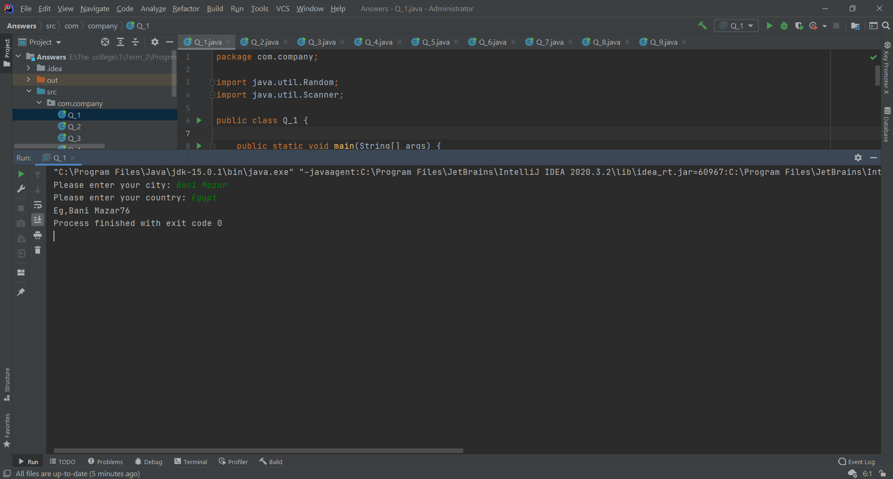
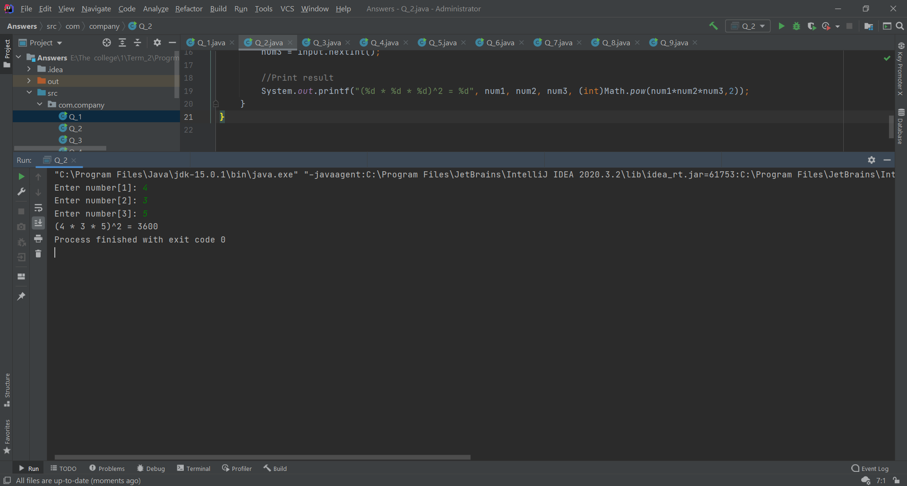
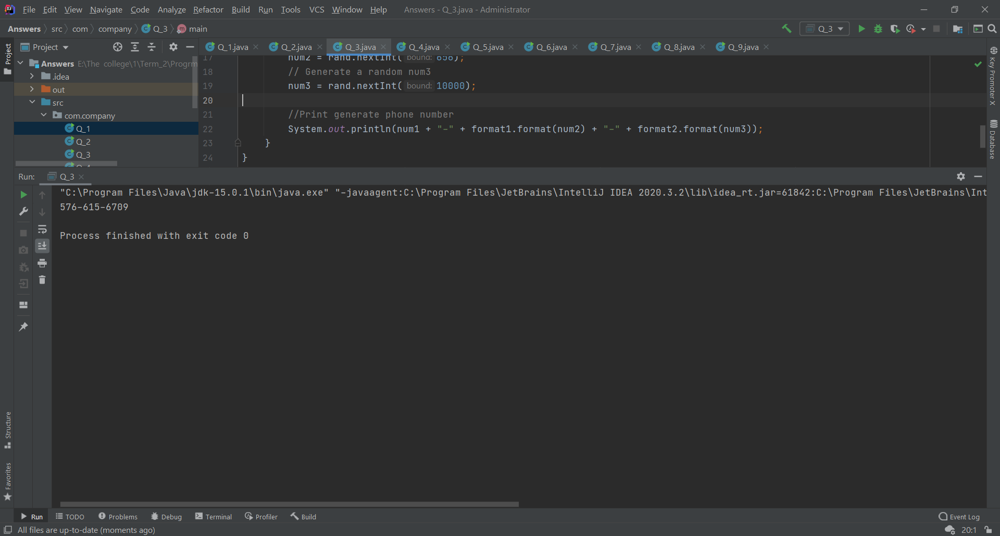
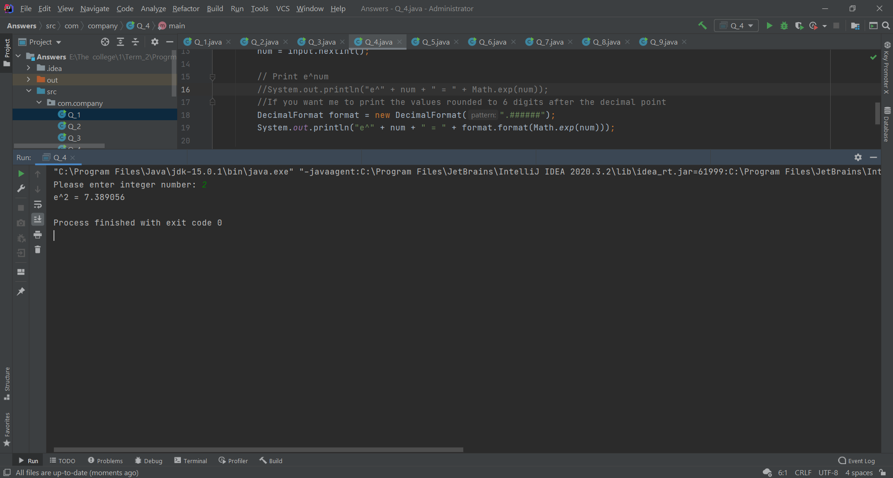
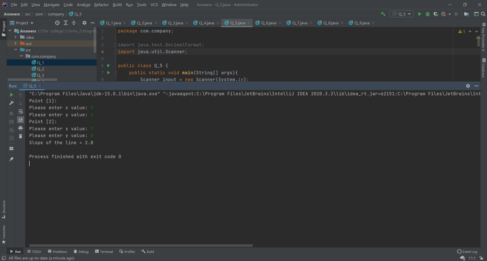
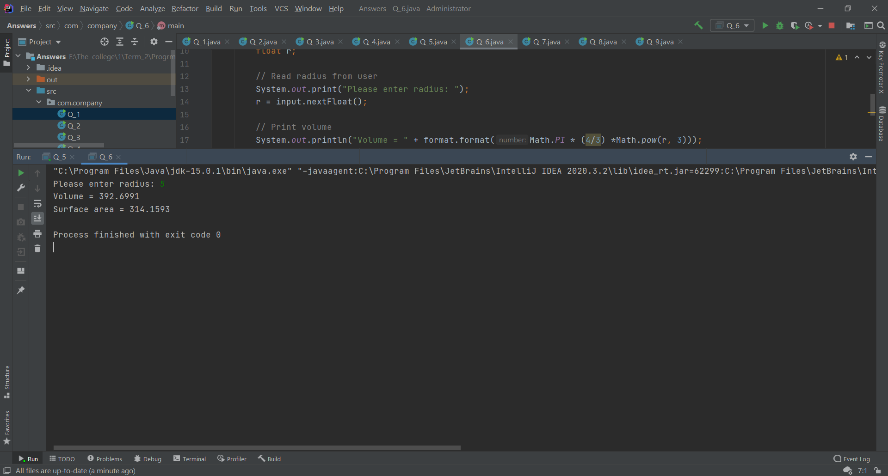
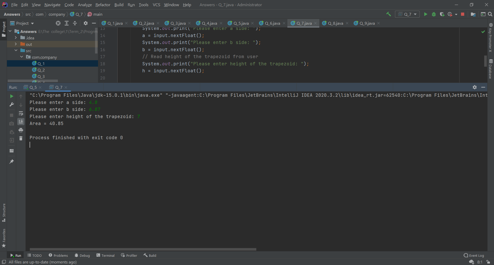
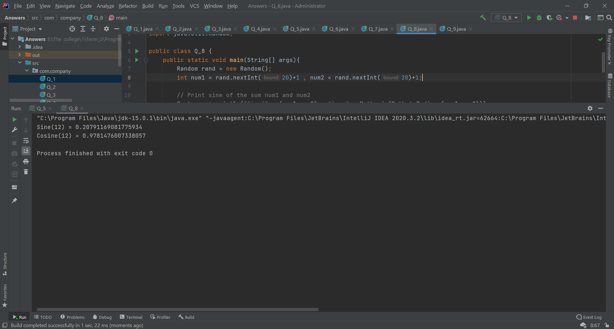
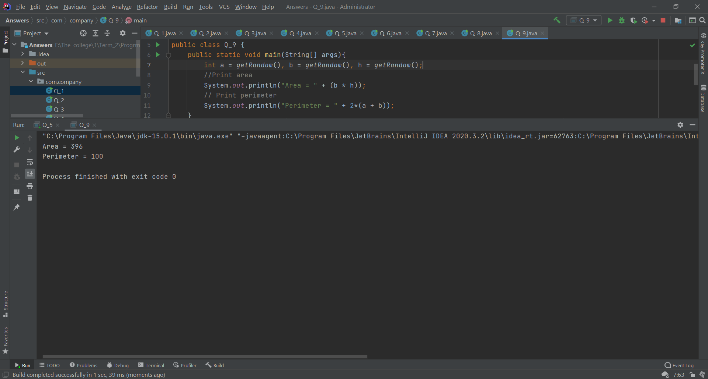

# Sheet 1 in programming 
## [Questions](https://github.com/Anas-Elgarhy/University/blob/main/1/Sheets/Sheet_1/Sheet%20%231.pdf)
## [Answers](https://github.com/Anas-Elgarhy/University/tree/main/1/Sheets/Sheet_1/Answers)
# Imges
### Question 1

### Question 2

### Question 3

### Question 4

### Question 5

### Question 6

### Question 7

### Question 8

### Question 9
